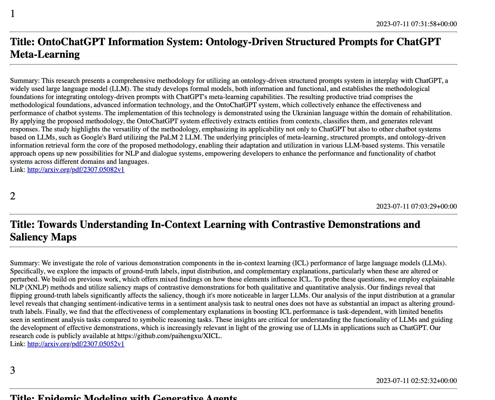

# Generate your own research paper feed!

This project is a Python-based tool that allows you to extract research papers from ArXiv, a popular online repository of scientific papers. It provides a convenient way to download and organize research papers for further analysis and reference.



## Prerequisites

- Python 3.x installed on your machine
- Required Python packages (specified in `requirements.txt`)

## Installation

1. Clone the repository:

``` shell
git clone https://github.com/DenimPatel/research-paper-feed.git
```
Change to the project directory:
``` shell
cd research-paper-feed
```

Install the required dependencies:
```shell
pip install -r requirements.txt
```

Run the script to extract research papers:
``` shell
python scripts/paper-collector.py
```
The extracted research papers will be saved under `results/` as an HTML feed, organized by category and publication date.

## Acknowledgments
The ArXiv API for providing access to the research papers.

## Contributing

Pull requests are welcome. For major changes, please open an issue first
to discuss what you would like to change.

Please make sure to update tests as appropriate.

## License

[MIT](https://choosealicense.com/licenses/mit/)