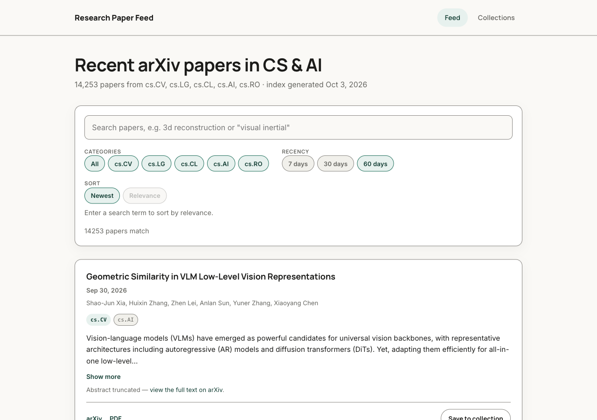

# Research Paper Feed

[](LICENSE)
[](https://www.python.org/)

An interactive feed of recent arXiv papers in computer vision, machine learning,
NLP, AI, and robotics — plus a Python CLI for pulling your own custom feeds.

**Live site:** <https://denimpatel.github.io/research-paper-feed/>



## What the web feed does

The hosted app is a static React site (GitHub Pages), so there is no server and
no runtime arXiv calls. A scheduled GitHub Action runs the Python index builder,
writes a sharded JSON index, and deploys it alongside the site. The browser then:

- searches a topic across titles, abstracts, and authors, with `"quoted phrase"`
  support and implicit AND across terms;
- filters by category (`cs.CV`, `cs.LG`, `cs.CL`, `cs.AI`, `cs.RO`) and by a
  7 / 30 / 60 day recency window, fetching only the week shards it needs;
- sorts by newest or by relevance (title matches rank above abstract matches);
- saves papers into multiple named **collections** stored in your browser's
  `localStorage`, and exports/imports a collection as JSON.

All metadata (title, authors, abstract, categories, dates) links out to arXiv.
Downloading PDFs or extracting figures is intentionally out of scope.

The index covers a rolling 60-day window. Saving a paper stores a full metadata
snapshot, so a collection keeps working after the paper ages out of the index.

## Run the web app locally

1. Build an index (needs network access to arXiv):

   ```shell
   pip install -r requirements.txt
   python scripts/build_index.py
   ```

   This writes `web/public/data/index.json` plus `data/papers-<YYYY>-W<NN>.json`.
   Useful flags, with the values they accept: `--retention-days` (1 or greater,
   default `60`), `--max-per-category` (0 or greater, default `0` = no cap — pass
   a small number for fast dev runs), `--abstract-chars` (1 or greater, default
   `500`), `--category` (repeatable; each value must look like `cs.AI`,
   `stat.ML` or `astro-ph.HE`, defaulting to `cs.CV`, `cs.LG`, `cs.CL`, `cs.AI`,
   `cs.RO`), and `--out-dir` (any writable directory, default
   `web/public/data`). An out-of-range or malformed value is rejected before
   anything is fetched or written.

2. Start the dev server:

   ```shell
   cd web
   npm install
   npm run dev
   ```

   The app is served under the Pages base path,
   <http://localhost:5173/research-paper-feed/>.

If the data files are missing, the app shows a clear "no paper index yet"
message instead of failing — so `npm run dev` still renders without a network
build.

### Web tests and build

```shell
cd web
npm test        # vitest: search, collections, and index loading
npm run build   # tsc --noEmit && vite build
```

## Python CLI

The original one-shot Python tool remains supported. It queries arXiv and writes
a static HTML dump into `results/`, and is independent of the web app.

Install dependencies:

```shell
pip install -r requirements.txt
```

Extract papers into an HTML feed:

```shell
python scripts/paper-collector.py --topic "cat:cs.CV AND \"3d reconstruction\"" --max-papers 200
```

Or run it interactively and enter the topic when prompted:

```shell
python scripts/paper-collector.py
```

The extracted papers are saved under `results/` as an HTML feed.

### CLI options

| Flag | Description | Default |
| --- | --- | --- |
| `--topic` | ArXiv search query. If omitted, you'll be prompted interactively. | _(prompted)_ |
| `--max-papers` | Maximum number of papers to pull. Must be 1 or greater. | `1000` |
| `--output-dir` | Directory the generated HTML feed is written to. | `results` |
| `--download-pdfs` | Also download each paper's PDF. | off |
| `--download-sources` | Also download and extract each paper's LaTeX source archive. | off |
| `--save-csv` | Also save the extracted metadata as a CSV file. | off |

The ArXiv query syntax supports field prefixes and boolean operators, for example:

- `cat:cs.CV AND "3d reconstruction"`
- `hd AND map AND generation`
- `visual AND inertial AND odometry`

See the [ArXiv API user manual](https://info.arxiv.org/help/api/user-manual.html#query_details) for the full query syntax.

### Notebook

A Jupyter notebook version of the same workflow is available at
[`notebooks/paper-collector.ipynb`](notebooks/paper-collector.ipynb) if you'd
rather run it interactively cell-by-cell (e.g. in Jupyter or Colab) instead of
from the command line.

## Deployment

`.github/workflows/deploy.yml` builds the index and deploys the site to GitHub
Pages on a daily schedule, on pushes to `main`, and on manual dispatch. CI
(`.github/workflows/ci.yml`) runs the Python `unittest` suite and the web
typecheck/tests.

> One-time setup: in the repository's **Settings → Pages**, set **Source =
> GitHub Actions**. The workflow cannot set this itself, and the first deploy
> fails without it.

## Acknowledgments

The ArXiv API for providing access to the research papers.

## Contributing

See [CONTRIBUTING.md](CONTRIBUTING.md) for guidelines on reporting issues and submitting pull requests.

## License

[MIT](https://choosealicense.com/licenses/mit/)
